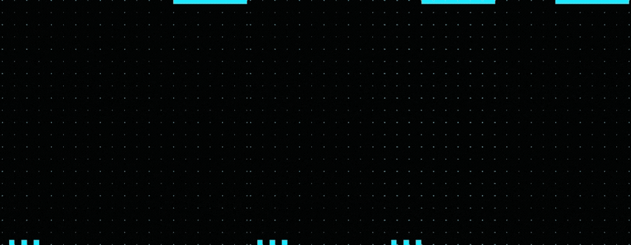

<p align="center">
    
<p 
  align="center" 
  width="100%"
>
🚀 Javascript | ReactJS | React Native | TypeScript | NodeJS | SQL | HTML | CSS | GIT
</p>

<p align="center">
  
  
</p>


<!--START_SECTION:waka-->
```text
TypeScript   32 hrs 47 mins  ⣿⣿⣿⣿⣿⣿⣿⣿⣿⣿⣿⣿⣿⣿⣿⣿⣿⣿⣿⣿⣿⣿⣄⣀⣀   88.44 % 
HTML         1 hr 33 mins    ⣿⣀⣀⣀⣀⣀⣀⣀⣀⣀⣀⣀⣀⣀⣀⣀⣀⣀⣀⣀⣀⣀⣀⣀⣀   04.19 % 
JavaScript   1 hr 25 mins    ⣿⣀⣀⣀⣀⣀⣀⣀⣀⣀⣀⣀⣀⣀⣀⣀⣀⣀⣀⣀⣀⣀⣀⣀⣀   03.84 % 
JSON         37 mins         ⣦⣀⣀⣀⣀⣀⣀⣀⣀⣀⣀⣀⣀⣀⣀⣀⣀⣀⣀⣀⣀⣀⣀⣀⣀   01.70 % 
Other        35 mins         ⣤⣀⣀⣀⣀⣀⣀⣀⣀⣀⣀⣀⣀⣀⣀⣀⣀⣀⣀⣀⣀⣀⣀⣀⣀   01.58 % 
```
<!--END_SECTION:waka-->

<!--
**cnogueira1/cnogueira1** is a ✨ _special_ ✨ repository because its `README.md` (this file) appears on your GitHub profile.

<p align="center" 
  width="100%" >
**Languages and Tools:**  

<code></code>
<code></code>
<code></code>
<code></code>
<code></code>  
</p>
Here are some ideas to get you started:

- 🔭 I’m currently working on ...
- 🌱 I’m currently learning ...
- 👯 I’m looking to collaborate on ...
- 🤔 I’m looking for help with ...
- 💬 Ask me about ...
- 📫 How to reach me: ...
- 😄 Pronouns: ...
- ⚡ Fun fact: ...
-->
